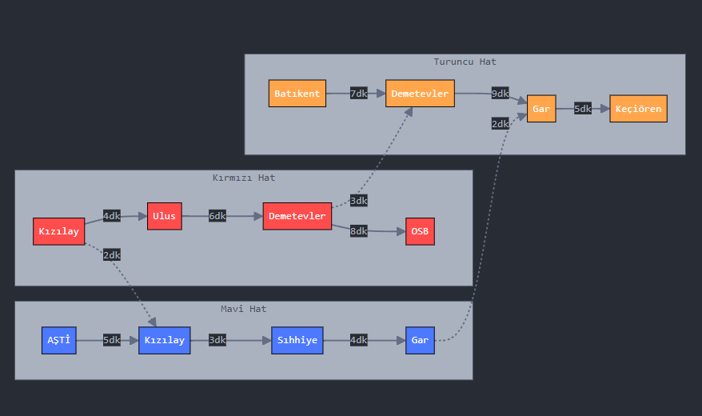
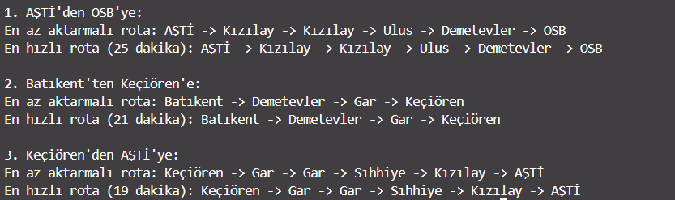

# Metro Simülasyonu Dokümantasyonu

## Proje Genel Bakışı

Proje aşağıdaki koşulları sağlayan bir metro ağı simülasyonu oluşturur:

1. BFS algoritmasını kullanarak iki istasyon arasında en az aktarmalı rotayı bulur.
2. A\* algoritmasını kullanarak iki istasyon arasında en hızlı rotayı bulur.

## Mermaid Diagram



## Kullanılan Teknolojiler ve Kütüphaneler

- **collections.deque**: BFS algoritması için kuyruk veri yapısını uygulanıldı.
- **heapq**: A\* algoritması için öncelik kuyruğunu uygulanıldı.
- **defaultdict**: İstasyonları metro hatlarına göre düzenlenildi.
- **typing**: Kod okunabilirliğini ve sürdürülebilirliği adına tip ipuçları için kullanıldı.

## Sınıflar ve Veri Yapıları

### Istasyon

Aşağıdaki parametrelere sahip bir metro istasyonunu temsil eder:

- `idx`: İstasyon için benzersiz tanımlayıcı(unique identifier, unique id olarak da söylebiliriz.)
- `ad`: İstasyonun adı
- `hat`: Bu istasyonun ait olduğu metro hattı
- `komsular`: Komşu istasyonlar ve seyahat süreleri listesi

### MetroAgi

Aşağıdaki bileşenlerle metro ağını yönetir:

- `istasyonlar`: İstasyon IDlerini Istasyon nesnelerine eşleyen dictionary
- `hatlar`: İstasyonları metro hatlarına göre düzenleyen dictionary

## Algoritmalar

### BFS (Genişlik Öncelikli Arama) - `en_az_aktarma_bul`

BFS, düğümleri (istasyonları) tek tek, seviye seviye keşfeder, bu da en az aktarma sayısına sahip yolları bulmak için idealdir.

#### Nasıl çalışır:

1. Başlangıç istasyonu ile başlayıp, bir kuyruğa eklendi.
2. Döngüleri önlemek adına zaten ziyaret edilen istasyonlar takip edildi.
3. Kuyrukta her istasyon:
   - Hedef olup olmadığı kontrol edildi.
   - Değilse, ziyaret edilmemiş tüm komşuları kuyruğa eklendi.
4. Hedef bulunana kadar veya kuyruk boşalana kadar devam edildi.

#### Uygulama Detayları:

- FIFO kuyruk işlemleri için `collections.deque` kullanıldı.
- Keşfederken her istasyona olan yolu(path) korundu.
- İstasyonlar arası seyahat sürelerini önemsemeyip, sadece durak sayısına odaklanıldı.

#### Zaman Karmaşıklığı: O(V + E)

- V: Düğüm sayısı (istasyonlar)
- E: Kenar sayısı (bağlantılar)

#### Yer Karmaşıklığı: O(V)

- Kuyruk ve ziyaret edilen kümesini depolamak için

### A\* Algoritması - `en_hizli_rota_bul`

A\*, aramayı hedefe yönlendirmek için bir sezgisel kullanan bilgilendirilmiş bir arama algoritmasıdır, bu da en kısa yolu bulmaya yarar.

#### Bileşenler:

- **g_score**: Başlangıçtan geçerli düğüme kadar olan gerçek maliyet
- **h_score**: Geçerli düğümden hedefe kadar olan tahmini maliyet (sezgisel)
- **f_score**: g_score + h_score (toplam tahmini maliyet)

#### Sezgisel Fonksiyon:

- Hat değişikliği gerekebileceğine dayalı ek maliyeti tahmin edildi.
- Kabul edilebilirdir (gerçek maliyeti asla fazla tahmin etmez)

#### Nasıl çalışır:

1. Başlangıç istasyonu ile başlanıldı ve f_score'a göre sıralanmış bir öncelik kuyruğuna eklenildi.
2. Her istasyon için bulunan en iyi g_score'u takip edildi
3. Öncelik kuyruğundaki her istasyon için:
   - Hedef olup olmadığını kontrol edildi
   - Değilse, tüm komşulara bakıldı ve daha iyi bir yol bulunursa g_score'ları güncellendi.
   - Komşuları f_score'ları ile öncelik kuyruğuna eklenildi.
4. Hedef bulunana kadar veya öncelik kuyruğu boşalana kadar devam edildi.

#### Uygulama Detayları:

- Verimli öncelik kuyruğu işlemleri için `heapq` kullanıldı
- Keşfedilen her istasyona bilinen en iyi yolu korundu
- Keşfi f_score'a göre önceliklendirildi
- f_score'lar denk olduğunda kararlı sıralama sağlamak adına istasyon kimliği, idsi kullanıldı

#### Zaman Karmaşıklığı: O(E + V log V)

- V: Düğüm sayısı (istasyonlar)
- E: Kenar sayısı (bağlantılar)

#### Yer Karmaşıklığı: O(V)

- Öncelik kuyruğu ve yol bilgilerini depolamak için

## Neden Bu Algoritmalar?

1. **En Az Aktarma için BFS:**

   - BFS doğal olarak en az aktarmaya sahip yolu bulur
   - Her kenar(edge) potansiyel bir aktarmayı temsil ettiğinde idealdir.
   - Uygulaması çok basit ve bu amaç adına gayet uyumludur.

2. **En Hızlı Rota için A\*:**
   - A\*, Dijkstra algoritmasını bir sezgiselle birleştirir.
   - İyi bir sezgisel mevcut olduğunda Dijkstra'dan daha verimlidir.
   - Hem seyahat sürelerini hem de potansiyel hat değişikliklerini hesaba katabilir.

## Örnek Kullanım

```python
# Metro ağını oluştur
metro = MetroAgi()

# İstasyonları ve bağlantıları ekle
metro.istasyon_ekle("K1", "Kızılay", "Kırmızı Hat")
metro.istasyon_ekle("M1", "AŞTİ", "Mavi Hat")
metro.baglanti_ekle("K1", "M1", 5)  # İstasyonları seyahat süresiyle bağla

# Rotaları bul
en_az_aktarma = metro.en_az_aktarma_bul("K1", "M1")
en_hizli_rota, toplam_sure = metro.en_hizli_rota_bul("K1", "M1")
```

## Output



## Olabilecek İyileştirmeler

1. **İşlevsellik:**

   - Günün saatlerine göre rota belirleme.
   - İstasyon bekleme süreleri de dikkate alınabilir.

   **Dahası duruma göre eklenecektir.**
