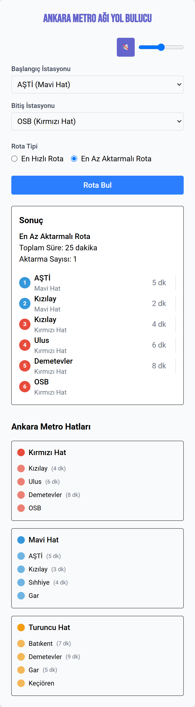
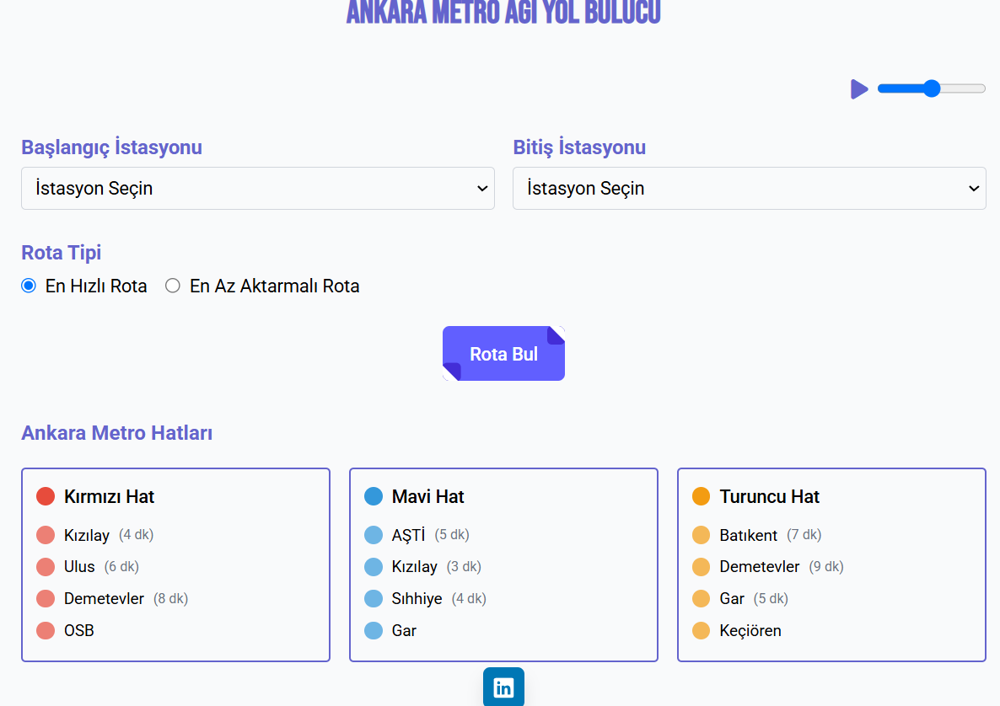

# Documentation for Metro Simulation

## Project Overview

This project implements a metro simulation that can find:

1. The route with the fewest transfers between two stations using the BFS algorithm
2. The fastest route between two stations using the A\* algorithm

You can find Turkish version of this documentation in the previous commit. Not recommended because I thought the terminology fits more in English.

## Link for the React Visualization

1. Here is the link for visualized as a UI version 1: https://tahirdincermetroprojeglobalaihub.netlify.app/
   If you click audio button or adjust the slider, you get the easter egg
2. Here is the version 2:
   https://tahirdincermetroglobalaihubv2.netlify.app/
   (At the bottom of this project an image of website is provided.)

## Mermaid Diagram


## Technologies and Libraries Used

- **collections.deque**: Used to implement the queue data structure for the BFS algorithm
- **heapq**: Used to implement the priority queue for the A\* algorithm
- **defaultdict**: Used to organize stations by metro lines
- **typing**: Used for type hints to improve code readability and maintainability

## Classes and Data Structures

### Station

Represents a metro station with the following attributes:

- `idx`: Unique identifier for the station
- `ad`: Name of the station
- `hat`: The metro line this station belongs to
- `komsular`: List of neighboring stations and travel times

### MetroAgi \ Metro Network

Manages the metro network with the following:

- `istasyonlar`: Dictionary mapping station IDs to Istasyon objects
- `hatlar`: Dictionary organizing stations by metro lines

## Algorithms

### BFS (Breadth-First Search) - `en_az_aktarma_bul`

BFS explores nodes (stations) level by level, making it ideal for finding paths with the minimum number of edges (transfers).

#### How does the project work:

1. Start with the initial station, then add it to a queue
2. Keep track of stations already've been visited to avoid cycles
3. For every station in the queue:
   - Check if it is the destination
   - If not, then add all unvisited neighbors to the queue
4. Continue until destination is found or queue is empty

#### Implementation Details:

- Uses `collections.deque` for efficient first-in-first-out queue operations
- Maintains the path to each station as we explore
- Ignores travel times between stations, focusing only on number of stops

#### Time Complexity: O(V + E)

- V: Number of vertices (stations)
- E: Number of edges (connections)

#### Space Complexity: O(V)

- For storing the queue and visited set

### A\* Algorithm - `en_hizli_rota_bul`

A\* is an informed search algorithm that uses a heuristic to guide the search toward the goal, making it efficient for finding the shortest path.

#### Components:

- **g_score**: The actual cost from the start to the current node
- **h_score**: The estimated cost from the current node to the goal (heuristic)
- **f_score**: g_score + h_score (total estimated cost)

#### Heuristic Function:

- Estimates additional cost based on whether a line change might be needed
- Is admissible (never overestimates the actual cost)

#### How it works:

1. Start with the initial station and add it to a priority queue ordered by f_score
2. Keep track of the best g_score found for each station
3. For each station in the priority queue:
   - Check if it's the destination
   - If not, explore all neighbors and update their g_scores if a better path is found
   - Add neighbors with their f_scores to the priority queue
4. Continue until destination is found or priority queue is empty

#### Implementation Details:

- Uses `heapq` for efficient priority queue operations
- Maintains the best known path to each explored station
- Prioritizes exploration based on f_score
- Uses station ID to ensure stable ordering when f_scores are equal

#### Time Complexity: O(E + V log V)

- V: Number of vertices (stations)
- E: Number of edges (connections)

#### Space Complexity: O(V)

- For storing the priority queue and path information

## Why These Algorithms?

1. **BFS for Fewest Transfers:**

   - BFS finds the path with the fewest edges
   - Ideal when each edge represents a potential transfer
   - Simple to implement and efficient for this purpose

2. **A\* for Fastest Route:**
   - A\* combines Dijkstra's algorithm with a heuristic
   - More efficient than Dijkstra's when a good heuristic is available
   - Can account for both travel times and potential line changes

## Sample Usage

```python
# Create the metro network
metro = MetroAgi()

# Add stations and connections
metro.istasyon_ekle("K1", "Kızılay", "Kırmızı Hat")
metro.istasyon_ekle("M1", "AŞTİ", "Mavi Hat")
metro.baglanti_ekle("K1", "M1", 5)  # Connect stations with travel time

# Find routes
fewest_transfers = metro.en_az_aktarma_bul("K1", "M1")
fastest_route, total_time = metro.en_hizli_rota_bul("K1", "M1")
```

## Output


## Potential Improvements

1. **Functionality:**

   - Add time dependent routing (for example rush hour)
   - Consider station wait times

   **Can add more later.**

## React Visualization

Two versions.



